# Earthquake web-based application.

## Interactive Front-End Development Milestone Project.

Earthquake website presents information about earthquakes events.
Users will be able to see earthquakes events as a table list and a map view.
Some general information will be provided in a knowledge base section.

This project is for educational purposes only. It is built using HTML, CSS and Javascript programing languages.
For functionality I used external frameworks and APIs.

## [View life website in github pages](https://marcin-kli.github.io/MP2/)
---
# Table of contents

- [UX](#ux)
    - [Strategy](#strategy)
    - [Scope](#scope)
        - [User stories](#user-stories)
    - [Structure of the website](#structure-of-the-website)
    - [Skeleton](#skeleton)
    - [Surface](#surface)
- [Features](#features)
- [Technology](#technology)
- [Testing](#testing)
- [Deployment](#deployment)
- [Credits](#credits)
- [Screenshots](#screenshots)

# UX

## Strategy

Tha main aim of this project is to create a simple website which shows information about earthquakes and interacts as a mobile app.
The site is divided into four parts. Major earthquakes in the last 30 days, major earthquakes in history, custom search and basic explanation what causes the earthquakes.
Site owner goal: provide interactive solution to search and display data and information about earthquakes.
User goal: find relevant data and some basic knowledge about earthquakes.

## Scope

As a MVP (minimum viable product) I divide landing page into 4 sections which show below features:
- list of the earthquakes in chosen period of time
- list of the 20 the biggest earthquakes in the past
- educational information
- map of the earthquakes as a search result

### User stories

As a site owner:
- I would like to show all information in a simple way on the website. Everything beyond should be redirected to external resources.
- I would like to show data about 20 the biggest earthquakes in the past.
- I would like to let users to search through earthquake events and show data as a list or on the map.

As a first time user:
- I would like to find out in an easy way what I can do on the website.
- I would like to check earthquake events without any scientific knowledge needed.

As a returning user:
- I would like to check all of the major events for from the last 7, 15 or 30 days.
- I would like to set custom settings and see all of the results in a list order.
- I would like to see my search results on the map.
- I would like to be able to contact with the site administrator.

## Structure of the website

All of the content is displayed on one page site with menu list on the top. 
In the middle of the site, on the landing page, there are four sections to choose by the user.
After selecting an option for the last/custom events user can select or deselect additional map option from top menu on mobile device.
On desktop the features are enabled by default. Changes can be also made from this menu.
At the bottom there is a footer with contact information and social links.

## Skeleton

### Wireframes

## Surface

### Colors

Colours used in a project:
Purpose | Colour value
------------ | -------------
background | # 262626
font | # fafafa
link |# fafafa
hoover | # 6c757d
top icon | # 85D945
section header | # 233CCC
table color: | # 7090D0
knowledge base header | # 458216
knowledge base card | # 458216

### Fonts

* As a main font I used Hind, and as a backup font serif.

### Images

I used images from:

*  [pexels.com](https://www.pexels.com) and it is credited in [credits](#credits) section.

*  [kids-fun-science.com](https://www.kids-fun-science.com) and it is credited in [credits](#credits) section.

[Back to Table of contents](#table-of-contents)
___
# Features

This project consist of one html page. It is divided into main 3 sections:
- navigation bar
- main page divided into four sections
- footer with contact button.

---
## Navigation bar

Navigation bar is located on the top of the website. It is responsive and will adapt to mobile devices.
The purpose of this bar is to have a link for a user to go to the main page on the left hand side and information icons on the right hand site.
### Navigation scheme:

On selected page this icons will highlight the feature by color change to green.
 
Here is an example for a custom search and list view features highlighted:

---
## Footer

Footer has a contact button and social links. Each social icon will open in a separate tab in a browser.

Contact button will open a modal with a contact form. Here is an example of contact form opened with details filled.

Contact form is linked to email.js API.

---
## Main page

#### There are four sections to choose on the main page.

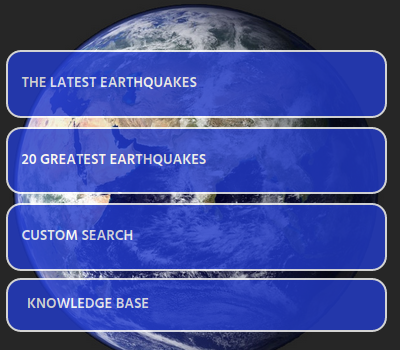

* ### The latest earthquakes
    This section provides data for the latest earthquakes from last 24 hours.
    Search function connects to USGS API and take relevant data from there.
    List icon is highlighted on this screen.
    
    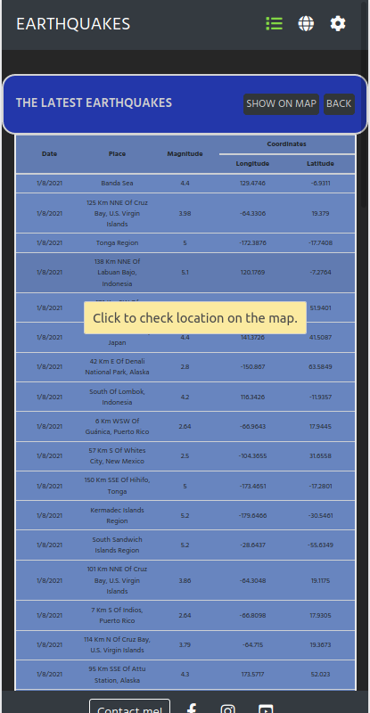

    From here there are options for:
    * Back button, to go back to main page.
    * Show on map button, to see results on the map.
    * Search through results, choose interesting event and display it on the map.
    On screenshot above selected row is highlighted and text is displayed in a tooltip.

    #### Show on map
    
    All points from list view are on the interactive map now. Bind tooltip is highlighted for chosen event. User can search the map, increase or decrease zoom and see details for events. 

    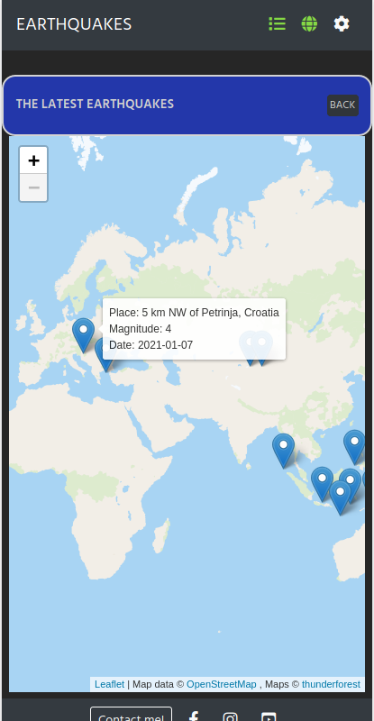

    #### Search through results
    From list view I choose a single result. Now I can see this event only.

    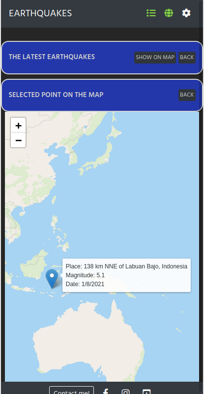

* ### 20 Greatest earthquakes

    In this section I had to set fixed data in a function.
    After setting magnitude to 8.4 and date to 1727-11-10 I got a list limited to 20 positions.
    Search results are sorted by date and map view options are the same like in the latest earthquakes section.

* ### Custom search

    In this section user has nearly endless possibilities to choose. Options are:

    Time period:
    * Last day
    * Last 7 days
    * Last 30 days
    * Custom - which is a selected date range

    Magnitude:
    * 2.5
    * 4.5
    * 6.5
    * Custom - a range from 2.5 to 9.5

    As an example I choose custom search for a days from 31/12/2020 to 09/01/2021 and custom magnitude 3.5.

    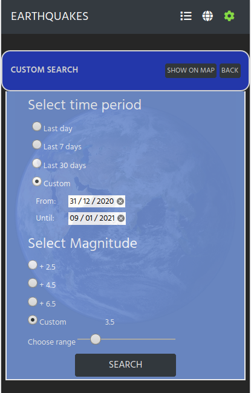

    As a result I can see Loading message for a short period of time.
    Waiting time always depends on the data size. I set a limit to do not go over acceptable time which can be around 15 seconds.
    This always vary and I recommend to start from fixed options first.

    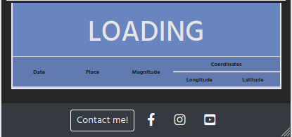

    Results for a data from custom search.

    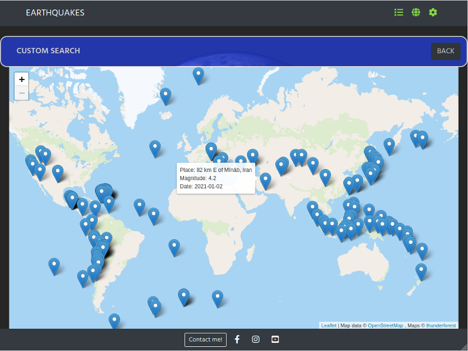

* ### Knowledge base

    This section is to provide basic knowledge about earthquakes.
    There are questions inside and user can get an answers by clicking a question.

     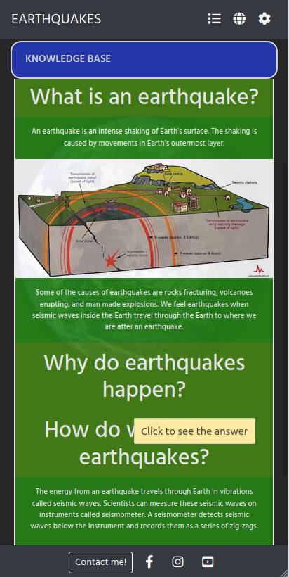

## Possible future implementations:

* sort search results in a table by headings
* change loading message for a progress bar
* create an option to build a knowledge base by a user

___
[Back to Table of contents](#table-of-contents)
___
# Technologies used

### HTML5
* As a structure language.

### CSS
* As a style language.

### Javascript
* As a programming language.

### Bootstrap 
* Bootstrap@4.5.3 as a CSS framework.

### jQuery 
* jQuery@3.5.1 as a JavaScript library

### Leaflet 
* Leaflet@1.7.1 as an open-source JavaScript library for interactive map

### Thunderforest 
* As a Map Tiles API

### USGS API
* As a Earthquake Catalog

### Email.js
* As a Javascript library

### Font Awesome
* As an icon library for navigation icons and social links.

### Google fonts
* As a font resource.

### GitHub
* As a software hosting platform to keep project in a remote location.

### Git
* As a version-control system tracking.

### Gitpod
* As a development hosting platform.

### Wireframe.cc
* As a wireframing tool.

### GNU Image Manipulation Program [GIMP]
* As an image editor.

[Back to Table of contents](#table-of-contents)
___
# Testing

### Testing section is located in [TEST.md](https://github.com/marcin-kli/MP2/blob/Milestone-Projects/TEST.md) file.

[Back to Table of contents](#table-of-contents)
___
# Deployment

The project was deployed on GitHub Pages. I used Gitpod as a development environment where I commited all changes to git version control system.
I used push command in Gitpod to save changes into GitHub.

To deploy a project I had to:

* Log in to GitHub and click on repository to deploy ([MP2](https://github.com/marcin-kli/MP2))
* select `Settings` and find GitHub Pages section at the very bottom of the page
* from source select `none` and then `Milestone-Projects` branch.
* click `save` and page was deployed after auto-refresh.
>  Your site is published at https://marcin-kli.github.io/MP2/

To run localy:
* Log in to GitHub and click on repository to download ([MP2](https://github.com/marcin-kli/MP2))
* select `Code` and click Download the ZIP file.
* after download you can extract the file and use it in your local environment 

Alternatively you can [Clone](https://docs.github.com/en/free-pro-team@latest/github/creating-cloning-and-archiving-repositories/cloning-a-repository)
or [Fork](https://docs.github.com/en/free-pro-team@latest/github/getting-started-with-github/fork-a-repo)
this repository ([MP2](https://github.com/marcin-kli/MP2)) into your github account.

[Back to Table of contents](#table-of-contents)
___
# Credits

* To complete this project I used Code Institute student template: [gitpod full template](https://github.com/Code-Institute-Org/gitpod-full-template)

* Ideas and knowledge library:

    * [w3schools.com](https://www.w3schools.com)

    * [getbootstrap.com/docs](https://getbootstrap.com/docs/4.5/getting-started/introduction/)

    * [tutorialrepublic.com/faq.php](https://www.tutorialrepublic.com/faq.php#javascript-jquery)

### Images:

* [pexels-pixabay-41953_s.jpg](https://www.pexels.com/photo/earth-space-universe-globe-41953/)

* [pt15-what-is-an-earthquake.jpeg](https://www.kids-fun-science.com/images/pt15-what-is-an-earthquake.jpg)

### Content:

Content for a knowledge base:
   * [spaceplace.nasa.gov](https://spaceplace.nasa.gov/earthquakes/en/)
   * [www.kids-fun-science.com](https://www.kids-fun-science.com/what-is-an-earthquake.html)

[Back to Table of contents](#table-of-contents)
___
# Screenshots

## Project screenshots

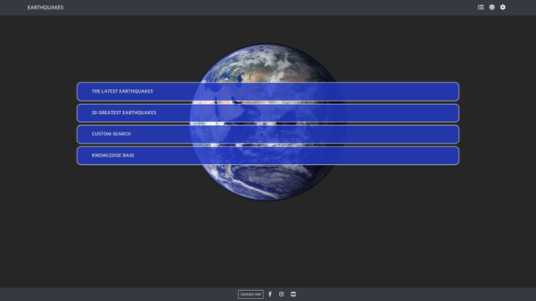

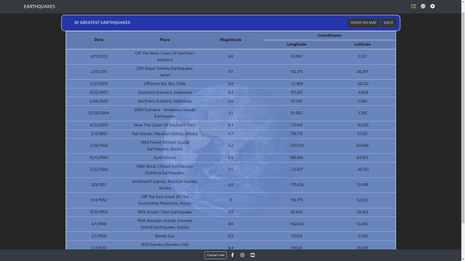

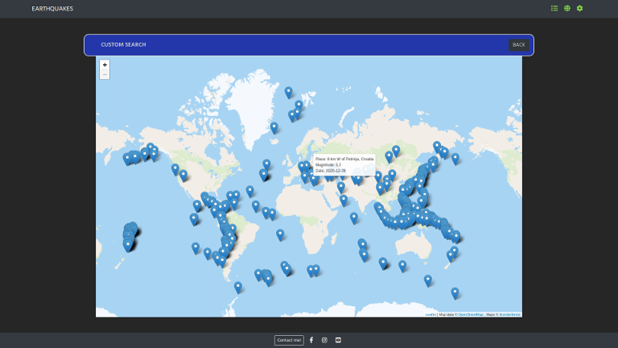

[Back to Table of contents](#table-of-contents)