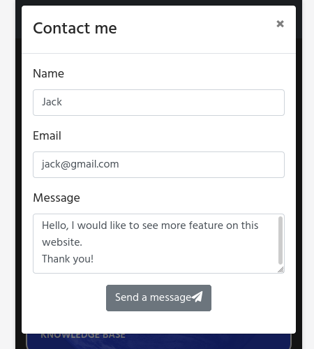

# Earthquake web-based application.

## Interactive Front-End Development Milestone Project.

Earthquake website presents information about earthquakes events.
Users will be able to see earthquakes events as a table list and a map view.
Some general information will be provided in a knowledge base section.

This project is for educational purposes only. It is built using HTML, CSS and Javascript programing languages.
For functionality I used external frameworks and APIs.

## [View life website in github pages](https://marcin-kli.github.io/MP2/)
---
# Table of contents

- [UX](#ux)
    - [Strategy](#strategy)
    - [Scope](#scope)
        - [User stories](#user-stories)
    - [Structure of the website](#structure-of-the-website)
    - [Skeleton](#sireframes)
    - [Surface](#surface)
- [Features](#features)
- [Technology](#technology)
- [Testing](#testing)
- [Deployment](#deployment)
- [Credits](#credits)
- [Screenshots](#screenshots)

# UX

## Strategy

Tha main aim of this project is to create a simple website which shows information about earthquakes and interacts as a mobile app.
The site is divided into four parts. Major earthquakes in the last 30 days, major earthquakes in history, custom search and basic explanation what causes the earthquakes.
Site owner goal: provide interactive solution to search, display data and information about earthquakes.
User goal: find relevant data and some basic knowledge about earthquakes.

## Scope

As a MVP (minimum viable product) I divide landing page into 4 sections which show below features:
- list of the earthquakes in chosen period of time
- list of the 20 the biggest earthquakes in the past
- educational information
- map of the earthquakes as a search result

### User stories

As a site owner:
- I would like to show all information in a simple way on the website. Everything beyond should be redirected to external resources.
- I would like to show data about 20 the biggest earthquakes in the past.
- I would like to let users to search through earthquake events and show data as a list or on the map.

As a first time user:
- I would like to find in an easy way what I can do on the website.
- I would like to check earthquake events without any scientific knowledge needed.

As a returning user:
- I would like to check all of the major events for from the last 7, 15 or 30 days.
- I would like to set custom settings and see all of the results in a list order.
- I would like to see my search results on the map.
- I would like to be able to contact with the site administrator.

## Structure of the website

All of the content is displayed on one page site with menu list on the top. 
In the middle of the site, on the landing page, there are four sections to choose by the user.
After selecting an option for the last/custom events user can select or deselect additional map option from top menu on mobile device.
On desktop the features are enabled by default. Changes can be also made from this menu.
At the bottom there is a footer with contact information and social links.

## Skeleton

### Wireframes

## Surface

### Colors

Colours used in a project:
Purpose | Colour value
------------ | -------------
background | # 262626
font | # fafafa
link |# fafafa
hoover | # 6c757d
top icon | # 85D945
section header | # 233CCC
table color: | # 7090D0
knowledge base header | # 458216
knowledge base card | # 458216

### Fonts

* As a main font I used Hind, and as a backup font serif.

### Images

I used images from:

*  [pexels.com](https://www.pexels.com) and it is credited in [credits](#credits) section.

*  [kids-fun-science.com](https://www.kids-fun-science.com) and it is credited in [credits](#credits) section.

[Back to Table of contents](#table-of-contents)
___
# Features

This project consist of one html page. It is divided into main 3 sections:
- navigation bar
- main page divided into four sections
- footer with contact button.

Details as below:

## Navigation bar

Navigation bar is located on the top of the website. It is responsive and will adapt to mobile devices.
The purpos of this bar is to have a link to main page on the left hend site and information icons on the right hand site.
### Navigation scheme:

On selected pages this icons will highlite the feature by color change to green.

Name | Default color | Highlited feature
------------ | ------------- | -------------
  List view | <i class="fa fa-list" aria-hidden="true"></i> | <i class="fa fa-list" aria-hidden="true"></i>
  Map view | <i class="fa fa-globe" aria-hidden="true"></i> | <i class="fa fa-globe" aria-hidden="true"></i>
  Custom settings | <i class="fa fa-cog" aria-hidden="true"></i> | <i class="fa fa-cog" aria-hidden="true"></i>

Example of custom view with a list feature highlited:

## Footer

Footer has contact button and social links. Each social icon will open in a separate tab in a browser.

Contact button will open a modal with a contact form.

[Back to Table of contents](#table-of-contents)
___
# Technologies used

[Back to Table of contents](#table-of-contents)
___
# Testing

[Back to Table of contents](#table-of-contents)
___
# Deployment

[Back to Table of contents](#table-of-contents)
___
# Credits

* To complete this project I used Code Institute student template: [gitpod full template](https://github.com/Code-Institute-Org/gitpod-full-template)

* Ideas and knowledge library:

    * [w3schools.com](https://www.w3schools.com)

    * [getbootstrap.com/docs](https://getbootstrap.com/docs/4.5/getting-started/introduction/)

### Images:

* [pexels-pixabay-41953_s.jpg](https://www.pexels.com/photo/earth-space-universe-globe-41953/)

* [pt15-what-is-an-earthquake.jpeg](https://www.kids-fun-science.com/images/pt15-what-is-an-earthquake.jpg)

[Back to Table of contents](#table-of-contents)
___
# Screenshots

[Back to Table of contents](#table-of-contents)