# Table of contents
- [Functionality testing](#functionality-testing)
- [Compatibility testing](#compatibility-testing)
- [User stories testing](#user-stories-testing)
- [Issues found during site development](#issues-found-during-site-development)
- [Performance testing](#performance-testing)
- [Code Validation](#code-validation)

## Functionality testing

I used Mozilla web developer tools and Chrome developer tools throughout the project for testing and solving problems with responsiveness and style issues.

Unicorn Revealer extension to chrome browser was very helpful.

### Main Page

Starting from the top of the page, I check:
* Navigation - page title, after clicking on the link page reloads as expected.
* Main page sections - all sections open to subsections as expected.
* Footer - Contact me button works and opens a modal, social sites open into a new browser tab.

### Modal form and Email.js testing

* Closing the modal by pressing an `x` button on the top right corner works as expected.
* All input boxes work, validation works as expected.
* Send a message button works as expected. Results:

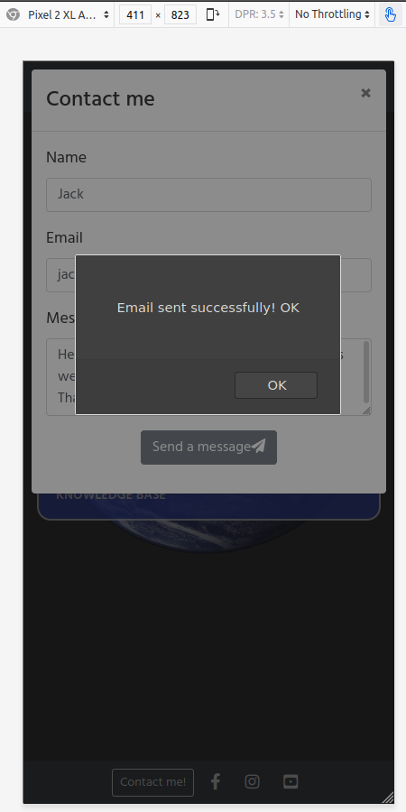

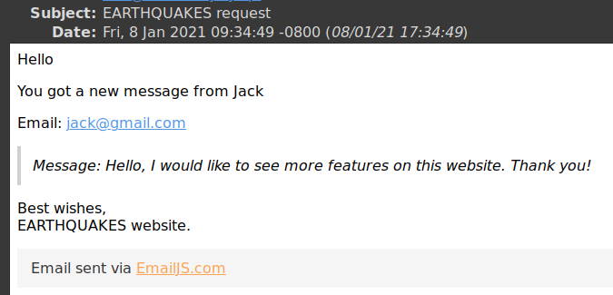

### The latest earthquakes and 20 greatest earthquakes options

Section opens as expected. `SHOW ON MAP` and `BACK` buttons work.

On the map search everything works as expected. On mouse over selected point is highlighted and tooltip displayed.
Zoom buttons work correctly.

Back to the list view. Selected search result is highlighted and tooltip is displayed on mouse over.
Single point map view works as expected and selected point is highlighted.

### Custom search

All radio buttons for time and magnitude work as expected.
* For `last day` magnitude is set to `+ 2.5`
* For `last 7 days` magnitude is set to `+ 4.5`
* For `last 30 days` magnitude is set to `+ 6.5` and `2.5` is disabled
* For `custom` magnitude is set to `custom`.
From and Until data input fields are enabled.
For a magnitude `custom` option is selected and choose renge is enabled.
Range control slider shows selected value after moving left or right.

If from date is selected for current or future date an alert box is displayed.
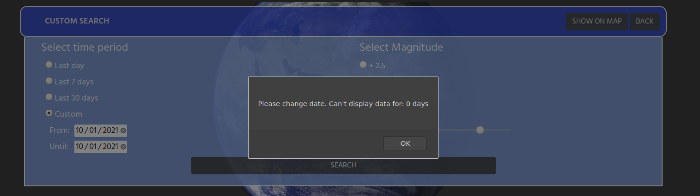

For custom time, below magnitude limits are set:
Minimim days | Maximum days |Mmagnitude
------------ | ------------- | -------------
 0 |10 | 2.5
 10 |30 | 4.5
 30 |90 | 5
 90 |450 | 5.5
 450 |1500 | 6
 1500 |4000 | 6.5
 4000 |12000 | 7
 12000 |40000 | 7.5
 40000 | | 8

This part was carefully tested during deployment.
I omit manual functionality testing here and paste a screenshot as a proof.

For selected days `+ 2.5` magnitude is disabled.

For selected days `+ 2.5` and `+ 4.5` magnitudes are disabled.
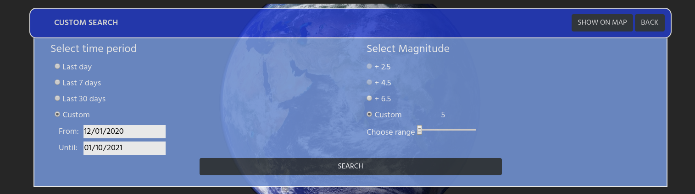

For selected days `+ 2.5` and `+ 4.5` are `+ 6.5` magnitudes are disabled.
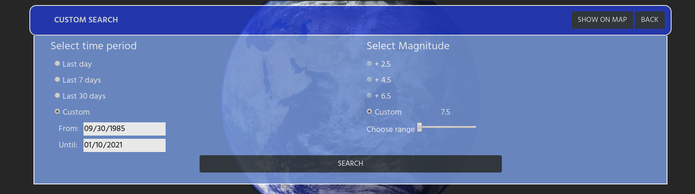

### Knowledge base

All subsections open and close by clicking a question.
Data is displayed correctly, image is responsive. No issues found.

[Back to Table of contents](#table-of-contents)
___
## Compatibility testing

Site was tested across multiple virtual mobile devices and browsers. I checked all supported devices in both Mozilla web developer tolls and Chrome developer tools.
The only issues found where for devices with screen width smaller than 360px.

I tested on hardware devices such as: Lenovo ideapad with Ubuntu and Windows OS's, Lenovo smartphone with Android 7, LG  smartphone with Android 8, Google pixel 3 with Android 11.
No issues found.

[Back to Table of contents](#table-of-contents)
___
## User stories testing

### As a site owner:

- I would like to show all information in a simple way on the website.
> Site is divided into four simple sections. All essential information about earthquakes can be found in the knowledge base.
> Contact form and social links can be find in the footer.
- I would like to show data about the biggest 20 earthquakes in the past.
> Second section on the website display required data.
- I would like to let users to search through earthquake events and show data as a list or on the map.
> Custom search is a relevant place to search through earthquake events.
> After clicking search button list is generated. Show on map button will display data in a map view.

### As a first time user:

- I would like to find out in an easy way what I can do on the website.
> All sections are clickable and all data is presented in a table or as a graphical representation on the map.
> Additionally, there are 3 icons on the top right corner which are highlighted in green when needed.
- I would like to check earthquake events without any scientific knowledge needed.
> No knowledge is needed. First two sections run automatically and this is the best place to start with.

### As a returning user:

- I would like to check all of the major events from the last 7, 15 or 30 days.
> In a custom search there are options for a last day, last seven and thirty days.
> There is no fixed option for 15 days but this can be set in a custom time.
- I would like to set custom settings and see all of the results in a list order.
> All search results are in a list view and sorted by date by default.
- I would like to see my search results on the map.
> All search results can be seen on the map by clicking show on map button.
- I would like to be able to contact with the site administrator.
> At the bottom of the page there is a contact me button.
> User can contact site administrator by filling the contact form from there.

[Back to Table of contents](#table-of-contents)
___
## Issues found during site development

The majority of the time I spent on this project was to work on the functions that will search through data chosen by the user.
Than function call USGS API, search through the API database and display all in an apropriate form to the user.
I had to do a lot of a testing during this stage. Some of the problems and bugs I solved are:

### Overloading a browser in customTime function.

If too much data was chosen from an API the browser could freeze or hang for a long time.
    To go around this I had to set else if statements to limit the data.

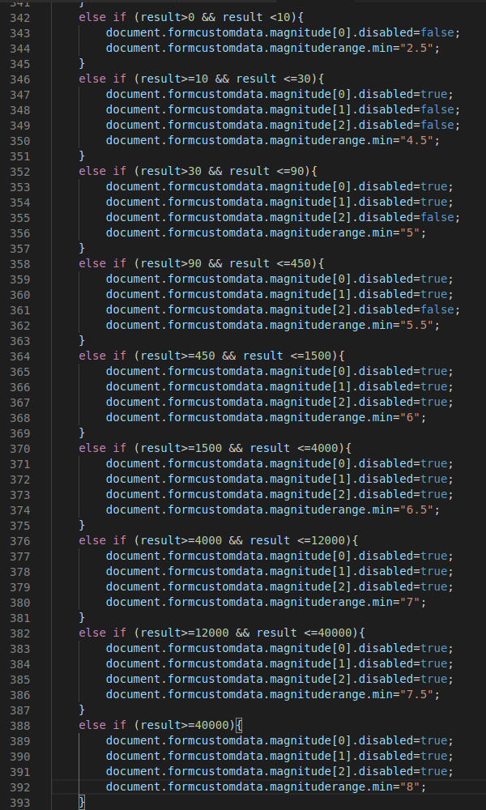

### Buttons do not show correctly in a Mozilla browser.
`SHOW ON MAP` and `BACK` buttons were one on the top of the other.

To fix this I had to add below code in css file for a mozilla browser only:
>`@supports (-moz-appearance:none) {
#greatest h2, #lastEarthquakes h2, #customData h2 {padding-right:1.75vh}}`

### Single point map view.

I wasn't able to display a single point because I had a layer with all points selected.

First I had to remove layer with all points showed by this function: `geoJsonLayer.removeFrom(mymap);`
   
After that assign a new single point on the map `marker = L.marker([ooo[4].innerHTML, ooo[3].innerHTML]) .addTo(mymap);`

---
### Minor bugs not solved:

#### List view highlited on map view
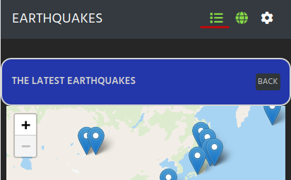

#### Custom number do not show when click on custom magnitude.

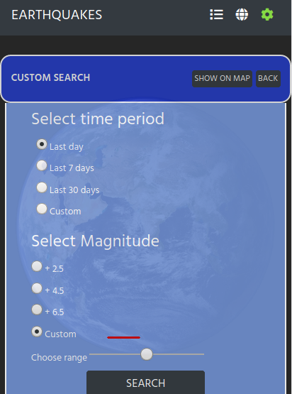

It appears after clicking the range bar.

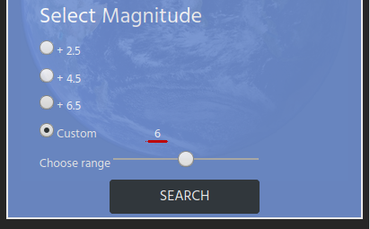

#### Different date format on single point map and multi point map

Single map view:

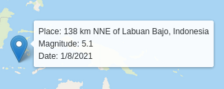 

Multipoint map view

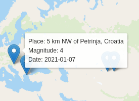

[Back to Table of contents](#table-of-contents)
___
## Performance testing

I run Lighthouse tool to check performance of the website.

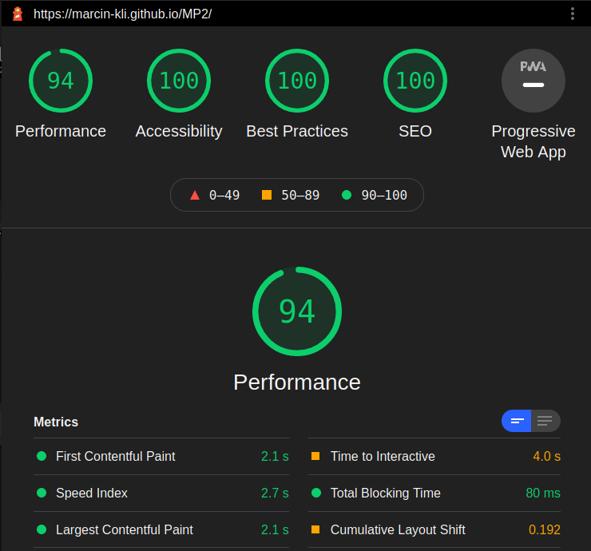

#### I noticed that first data pulling from USGS API takes more time. After that all searches are smooth.

[Back to Table of contents](#table-of-contents)
___
## Code Validation

 At the and of the project I used two websites to validate the code
 * [Jshint](https://jshint.com/) to test JavaScript
 * [W3C CSS Validator](https://jigsaw.w3.org/css-validator/) to validate CSS
 * [Nu Html Checker](https://validator.w3.org/) to test HTML

### Results:
#### code.js
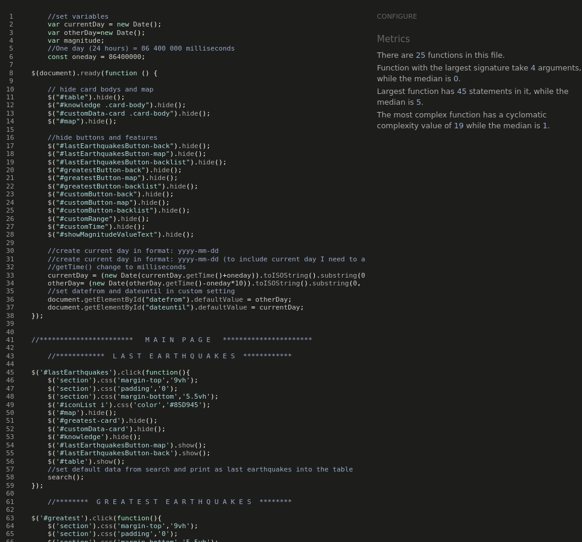
#### email.js
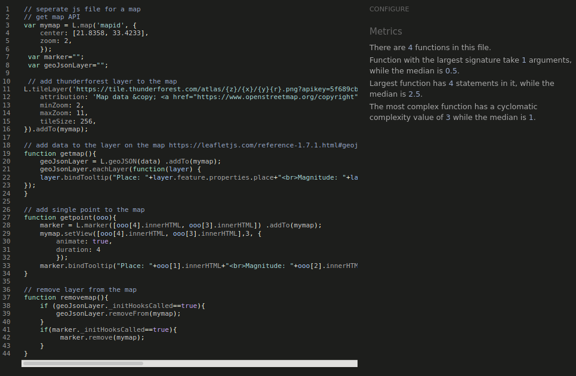
#### map.js
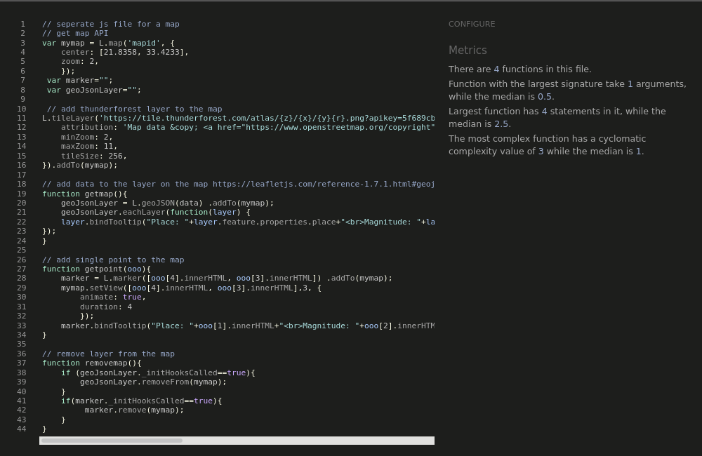
#### index.html
First time:

After fixing:

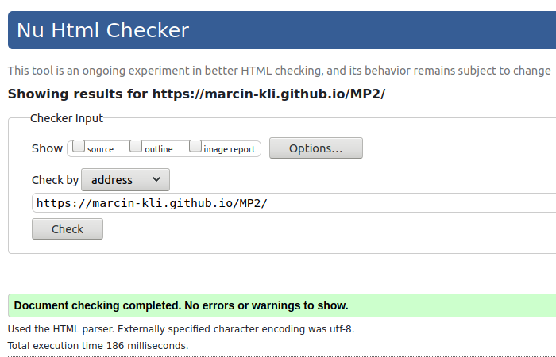
#### style.css
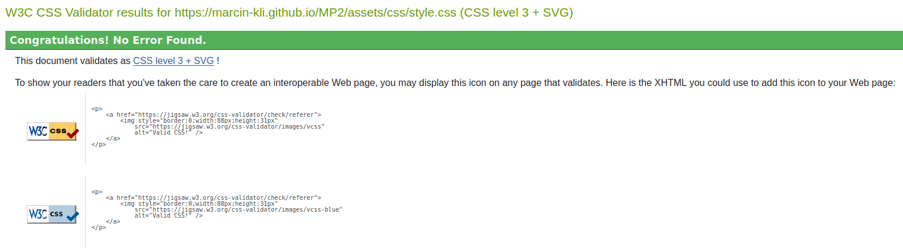

[Back to Table of contents](#table-of-contents)

#### Back to [README.md](https://github.com/marcin-kli/MP2)