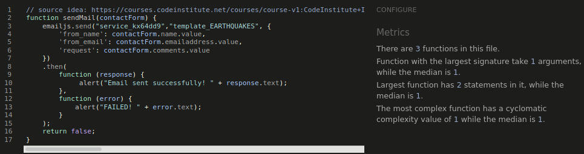

# Table of contents
- [Functionality testing](#functionality-testing)
- [Compatibility testing](#compatibility-testing)
- [User stories testing](#user-stories-testing)
- [Issues found during site development](#issues-found-during-site-development)
- [Performance testing](#performance-testing)
- [Code Validation](#code-validation)

## Functionality testing

I used Mozilla web developer tools and Chrome developer tools throughout the project for testing and solving problems with responsiveness and style issues.

Unicorn Revealer extension to chrome browser was very helpful.

### Main Page

Starting from the top of the page, I check:
* Navigation - page title, after clicking on the link page reloads as expected.
* Main page sections - all sections open to subsections as expected.
* Footer - Contact me button works and opens a modal, social sites open into a new browser tab.

### Modal form and Email.js testing:
* Closing a modal by pressing an `x` button on the top right corner works as expected.
* All input boxes works, validation works as expected.
* Send a message button works as expected. Results:

### The latest earthquakes and 20 greatest earthquake options
Section opens as expected. `Show on map` and `back` buttons work.

On a map search everything works as expected. On mouse over selected point is highlighted and tooltip displayed.
Zoom buttons work correctly.

Back to the list view. Selected search result is highlighted and tooltip is displayed on mouse over.
Single point map view works as expected and selected point is highlighted.

### Custom search

All radio buttons for time and magnitude work as expected.
* For `last day` magnitude is set to `+ 2.5`
* For `last 7 days` magnitude is set to `+ 4.5`
* For `last 30 days` magnitude is set to `+ 6.5` and `2.5` is disabled
* For `custom` magnitude is set to `custom`.
From and Until data input fields are enabled.
For a magnitude `custom` option is selected and choose renge is enabled.
Range control slider shows selected value after moving left or right.

If from date is selected for current or future date an alert box is displayed.

For custom time, below magnitude limits are set:
Minimim days | Maximum days |Mmagnitude
------------ | ------------- | -------------
 0 |10 | 2.5
 10 |30 | 4.5
 30 |90 | 5
 90 |450 | 5.5
 450 |1500 | 6
 1500 |4000 | 6.5
 4000 |12000 | 7
 12000 |40000 | 7.5
 40000 | | 8

This part was carefully tested during deployment.
I will omit manual functionality testing here and paste a screenshot as a proof.

For selected days `+ 2.5` magnitude is disabled.

For selected days `+ 2.5` and `+ 4.5` magnitudes are disabled.

For selected days `+ 2.5` and `+ 4.5` are `+ 6.5` magnitudes are disabled.

### Knowledge base

All subsections open and close by clicking a question.
Data is displayed correctly, image is responsive. No issues found.

[Back to Table of contents](#table-of-contents)
___
## Compatibility testing

Site was tested across multiple virtual mobile devices and browsers. I checked all supported devices in both Mozilla web developer tolls and Chrome developer tools.
The only issues found where for devices with screen width smaller than 360px.

I tested on hardware devices such as: Lenovo ideapad with Ubuntu and Windows OS's, Lenovo smartphone with Android 7, LG  smartphone with Android 8, Google pixel 3 with Android 11.
No issues found.

[Back to Table of contents](#table-of-contents)

___
## User stories testing

[Back to Table of contents](#table-of-contents)
___
## Issues found during site development

[Back to Table of contents](#table-of-contents)

___
## Performance testing

I run Lighthouse tool to check performance of the website.

[Back to Table of contents](#table-of-contents)
___
## Code Validation

 At the and of the project I used two websites to validate a code
 * [Jshint](https://jshint.com/) to test JavaScript
 * [W3C CSS Validator](https://jigsaw.w3.org/css-validator/) to validate CSS
 * [Nu Html Checker](https://validator.w3.org/) to test HTML

### Results:
#### code.js

#### email.js

#### map.js

#### index.html
First time:

After a fix:

#### style.css

[Back to Table of contents](#table-of-contents)

#### Back to [README.md](https://github.com/marcin-kli/MP2)